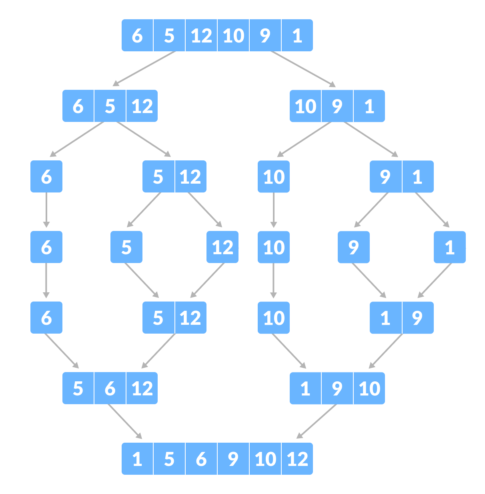

## Merge-Insertion Sorting Algorithm

The Merge-Insertion sorting algorithm, often referred to as the **Ford-Johnson algorithm**, is a sophisticated sorting technique that combines the strengths of both **Merge Sort** and **Insertion Sort**. This hybrid approach leverages divide and conquer strategies to efficiently sort arrays or lists.

### Merge Sort

Merge Sort is a classic divide and conquer algorithm known for its stability and efficient performance. Here's how it works:

1. **Divide**: Split the array into two halves.
2. **Conquer**: Recursively sort each half.
3. **Combine**: Merge the sorted halves to produce the sorted array.

Merge Sort achieves a time complexity of O(n log n), making it suitable for large datasets.



### Insertion Sort

Insertion Sort is a simple yet effective algorithm for sorting small arrays or partially sorted arrays. Here's the step-by-step process:

1. **Build**: Start with the first element, assuming it's sorted.
2. **Insert**: Take each subsequent element and insert it into its correct position among the already sorted elements.
3. **Repeat**: Continue until all elements are sorted.

Insertion Sort is efficient for small datasets and has a time complexity of O(n^2), but it performs well when the dataset is already partially sorted.

#### Example of Insertion Sort:

Consider sorting the following array:


1. Begin with the first element assumed to be sorted.
2. Insert each subsequent element into its correct position among the sorted elements.


## Code Functionality

### 1. Parse Sequence

The program begins by parsing the sequence of positive integers provided. It checks for validity, ensuring each argument is a positive integer.

### 2. Initialization of Containers

Two containers, are initialized using the parsed sequence. These containers will be used to store and sort the integers using the Merge-Insert algorithm.
For this exercise I choose the `std::deque` and `std::list` , but only one is "better". You'll see.

### 3. Sorting with Merge-Insert Algorithm

#### For std::deque

- **mergeInsertSortDeque**: This function recursively applies the Merge-Insert algorithm to a `std::deque` of integers. It splits the deque into halves, recursively sorts each half, and merges them back in sorted order using the `std::merge` function.
	-	**std::merge**: is a function that merges two sorted sequences into one.

#### For std::list

- **mergeInsertSortList**: Similarly, this function applies the Merge-Insert algorithm to a `std::list` of integers. It splits the list into halves using `std::list::splice`, recursively sorts each half, and merges them back in sorted order using `std::list::merge`.
-	- **std::list::splice**: allows elements to be transferred between lists efficiently without copying, crucial for splitting the list into halves during the sorting process
-	- **std::list::merge**: Similar to **std::merge**

### 4. Time Measurement

- **getDequeSortTime**: Measures the execution time required to sort the sequence using `std::deque`. It captures the time before and after sorting using `gettimeofday` and calculates the elapsed time in microseconds.
  
- **getListSortTime**: Measures the execution time required to sort the sequence using `std::list`. Similar to `getDequeSortTime`, it captures the time before and after sorting and calculates the elapsed time.

### 5. Output Results

- **Printing Results**: After sorting each container, the program prints:
  - The original unsorted sequence of integers.
  - The sorted sequence of integers after applying the Merge-Insert algorithm.
  - The time taken to sort the sequence using `std::deque`.
  - The time taken to sort the sequence using `std::list`.
  #### Exemple:
  ```
	┌──[sopa㉿]-[ex02]
	└─$> ./PmergeMe 3 5 9 7 4
	Before: 3 5 9 7 4 
	After:  3 4 5 7 9 
	Time to process a range of 5 elements with std::list:   38 us
	Time to process a range of 5 elements with std::deque:  245 us
  ```

# Resources

[Programiz - Merge Sort Algorithm](https://www.programiz.com/dsa/merge-sort) <br>
[Programiz - Insertion Sort Algorithm](https://www.programiz.com/dsa/insertion-sort)<br>
[Carolina Daniel - README.md](https://github.com/caroldaniel/42sp-cursus-cpp/blob/main/cpp_module_09/ex02/README.md)<br>
[Pavi Ravi - Johnson 's Algorithm in 11min (video)](https://www.youtube.com/watch?v=xc2ua8sQAoE)